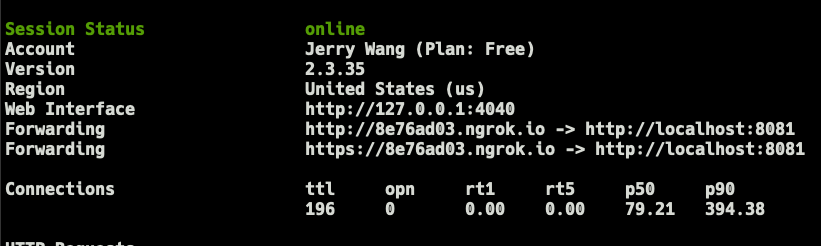
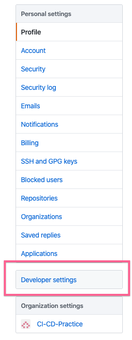
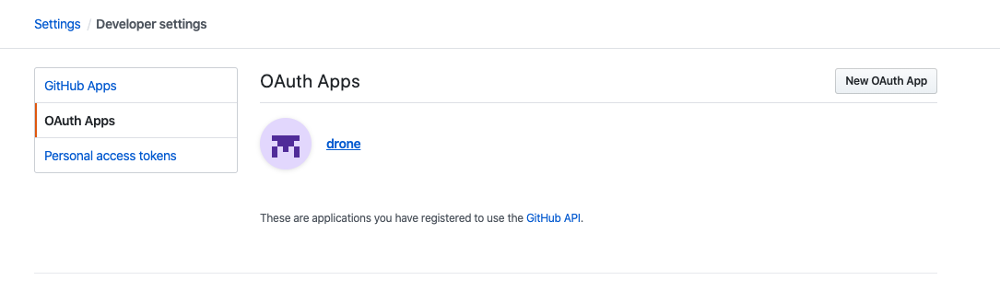
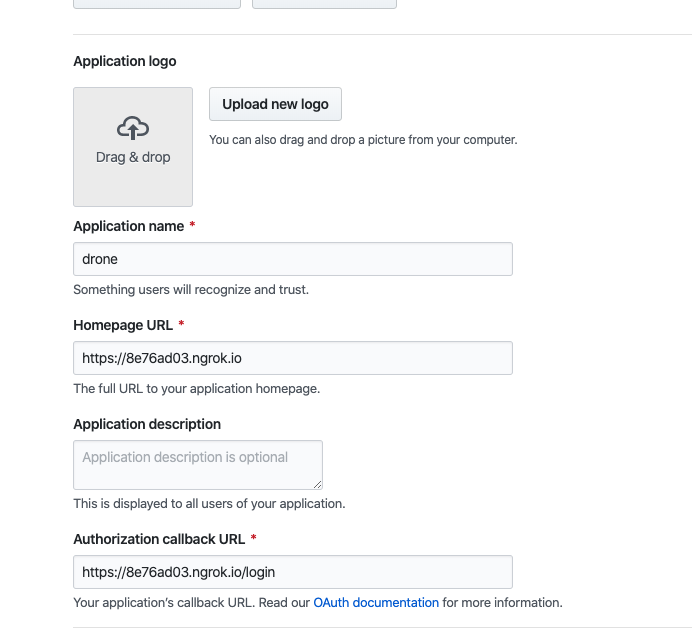

# Drone CI Practice

## Setup

- copy `.env` and input your credentials

```
cp .env.example .env
```

- ngrok generate https for testing

```
ngrok http 8081
```



replace `DRONE_SERVER_HOST=8e76ad03.ngrok.io` without `https://`

- Generate RPC Secret

```
 openssl rand -hex 16
```

replace `DRONE_RPC_SECRET=`

- generate github credential





## Start the App

```
docker-compose up -d
```

And navigate to `localhost:8081`

## Drone Note

**process**

- git clone
- test
- build
- deploy
- send message

## Ref

### Drone

- https://medium.com/starbugs/%E5%BE%9E%E9%9B%B6%E9%96%8B%E5%A7%8B%E5%AD%B8-devops-%E9%82%A3%E5%B0%B1%E9%81%B8%E6%93%87%E6%9C%80%E7%B0%A1%E5%96%AE%E7%9A%84-drone-ci-%E9%96%8B%E5%A7%8B%E5%90%A7-931126671139

- https://drone.io/
- https://ithelp.ithome.com.tw/users/20120491/ironman/2538

### Installation

- https://medium.com/faun/setup-a-drone-cicd-environment-on-docker-with-letsencrypt-69b259d398fb

### Ngrok

- https://ngrok.com/
